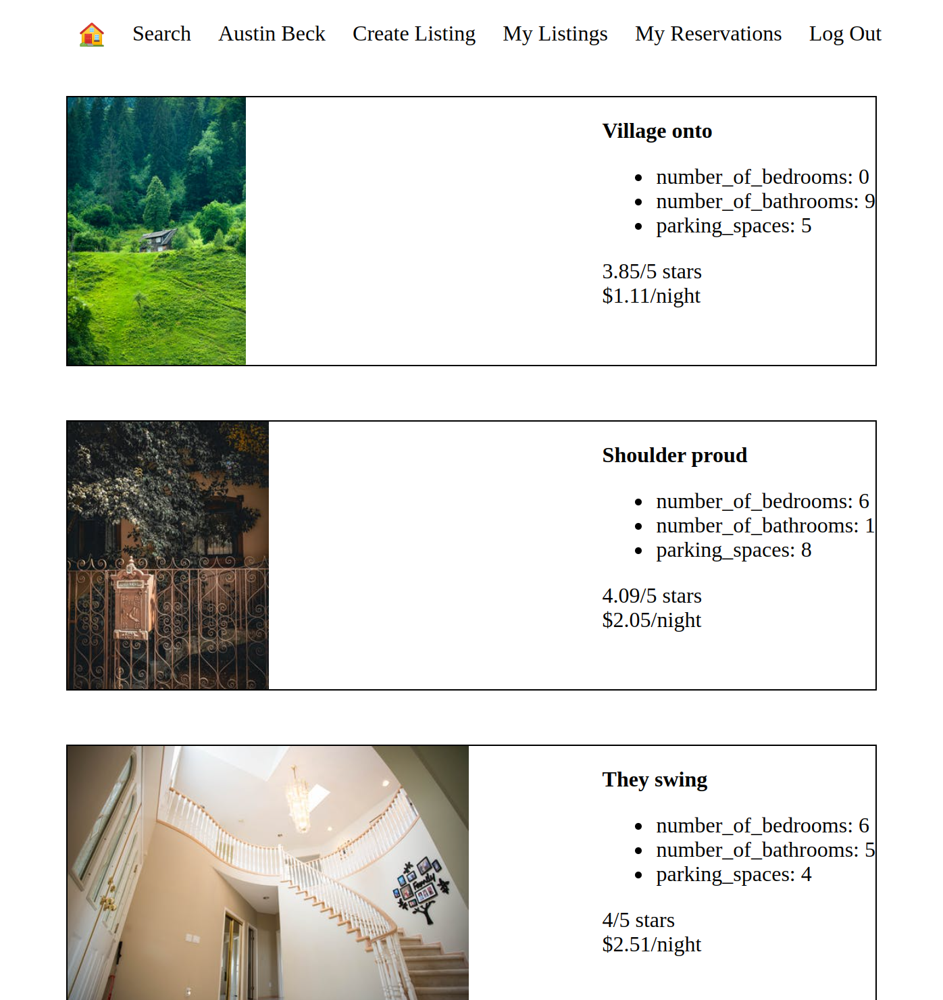
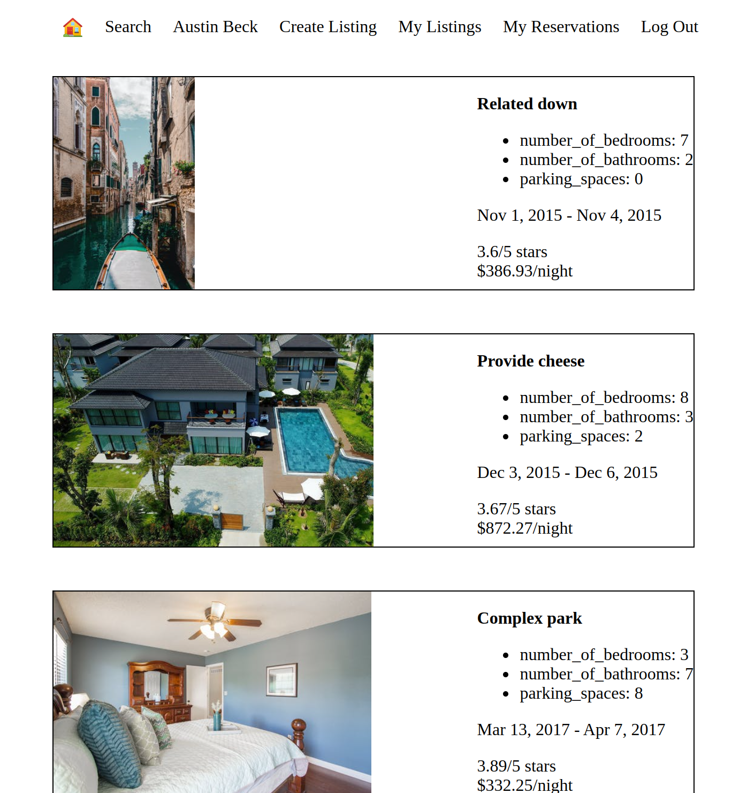

# LightBnB
This is a very basic AirBnB clone called LightBnb which I completed at LightHouse labs Bootcamp to focus on learning how to connect to and query the database using the user's input data.

## Screenshots
Desktop View showing Listings Page once a user is Logged In

Desktop View showing the Reservations Page


## Project Structure
```
├── db
│   ├── index.js
├── public
│   ├── index.html
│   ├── javascript
│   │   ├── components 
│   │   │   ├── header.js
│   │   │   ├── login_form.js
│   │   │   ├── new_property_form.js
│   │   │   ├── property_listing.js
│   │   │   ├── property_listings.js
│   │   │   ├── search_form.js
│   │   │   └── signup_form.js
│   │   ├── index.js
│   │   ├── libraries
│   │   ├── network.js
│   │   └── views_manager.js
│   └── styles
├── sass
├── server
│   ├── apiRoutes.js
│   ├── database.js
│   ├── json
│   └── userRoutes.js
└── app.js
```
* `db` contains the database connection
* `public` contains all of the HTML, CSS, and client side JavaScript. 
  * `index.html` is the entry point to the application. 
  * `javascript` contains all of the client side javascript files.
    * `index.js` starts up the application by rendering the listings.
    * `network.js` manages all ajax requests to the server.
    * `views_manager.js` manages which components appear on screen.
    * `components` contains all of the individual html components. They are all created using jQuery.
* `sass` contains all of the sass files. 
* `server` contains all of the server side and database code.
  * `apiRoutes.js` and `userRoutes.js` are responsible for any HTTP requests to `/users/something` or `/api/something`. 
  * `json` is a directory that contains a bunch of dummy data in `.json` files.
  * `database.js` is responsible for all queries to the database.
  * `app.js` is the entry point to the application. This connects the routes to the database.

## Getting Started
  1. Clone this repository & ```cd LightBnB_WebApp-master```
  2. run npm install
  3. start the web server using ```npm start```
  4. Go to http://localhost:3000/ in your browser
